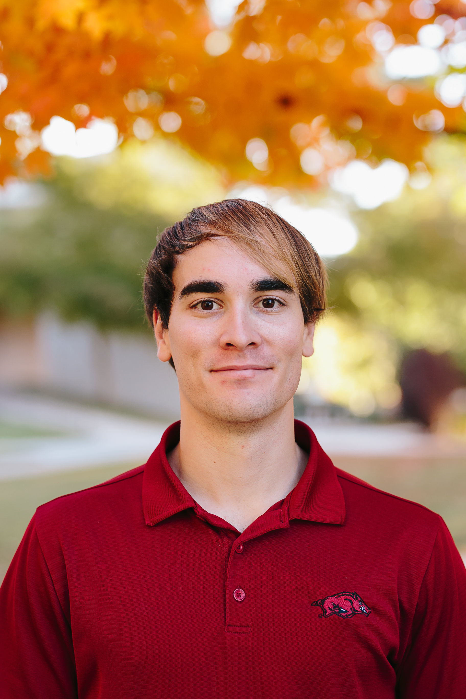

 {
                                        width: 70%;
                                        height: 70%;
                                        border: none;
                                        background: none;
                                      } 
I am currently a second year PhD student in Prof. Larry Biegler's group at Carnegie Mellon University. A summary of my current research can be found [here](http://numero.cheme.cmu.edu/research.html). My current research project is focused on estimating kinetic parameters using nonlinear programming strategies and maximum likelihood methods for mixed-effect models. The current goals are to quantify parameter values and confidence intervals and apply Bayesian inference techniques for model discrimination to identify the most likely model given the experimental data. 

Here is my [LinkedIn](https://www.linkedin.com/in/tom-krumpolc-9b064513a/) page. 

Outside of my research, my hobbies include snowboarding, hiking, and real estate/home imporvement projects. 
